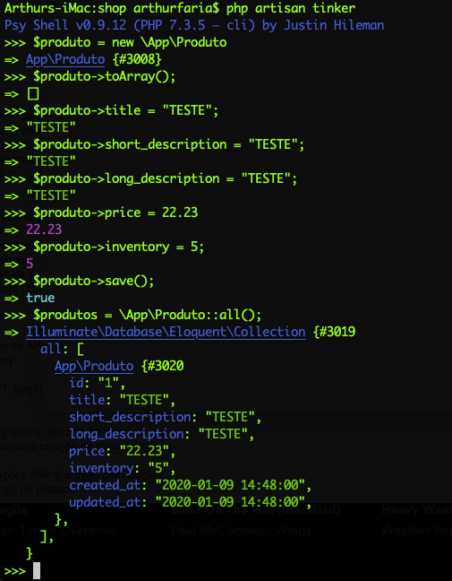

### Criando uma entidade

A criação de entidades no Laravel segue o princípio de gerenciamento de dados primeiro. Vamos então criar uma migração com as colunas necessárias para armazenar o produto:

```bash
php artisan make:migration create_produtos_table --create=produtos
```

```php
<?php

use Illuminate\Database\Migrations\Migration;
use Illuminate\Database\Schema\Blueprint;
use Illuminate\Support\Facades\Schema;

class CreateProdutosTable extends Migration
{
    /**
     * Run the migrations.
     *
     * @return void
     */
    public function up()
    {
        Schema::create('produtos', function (Blueprint $table) {
            $table->bigIncrements('id');
            $table->string('title');
            $table->string('short_description');
            $table->string('long_description')->nullable();
            $table->float('price', 8, 2)->default(0);	
            $table->integer('inventory')->default(0);	
            $table->timestamps();
        });
    }

    /**
     * Reverse the migrations.
     *
     * @return void
     */
    public function down()
    {
        Schema::dropIfExists('produtos');
    }
}

```

E agora, podemos executar o comando de migração novamente:

```bash
php artisan migrate
```


Com o banco gerado, vamos criar nosso modelo do Eloquent para que possamos recuperar as informações lá presentes:

```bash
php artisan make:model Produto
```

E no arquivo `\app\Produto.php`

```php
<?php

namespace App;
// https://laravel.com/docs/6.x/eloquent
use Illuminate\Database\Eloquent\Model;

class Produto extends Model
{
    protected $table = 'produtos';
   protected $fillable = [
        'title', 'short_description', 'long_description', 'price', 'inventory'
    ];
}
```

E agora, podemos utilizar o comando interativo para verificar como está a entidade Produto:


E finalmente adicionar um novo produto:



 

